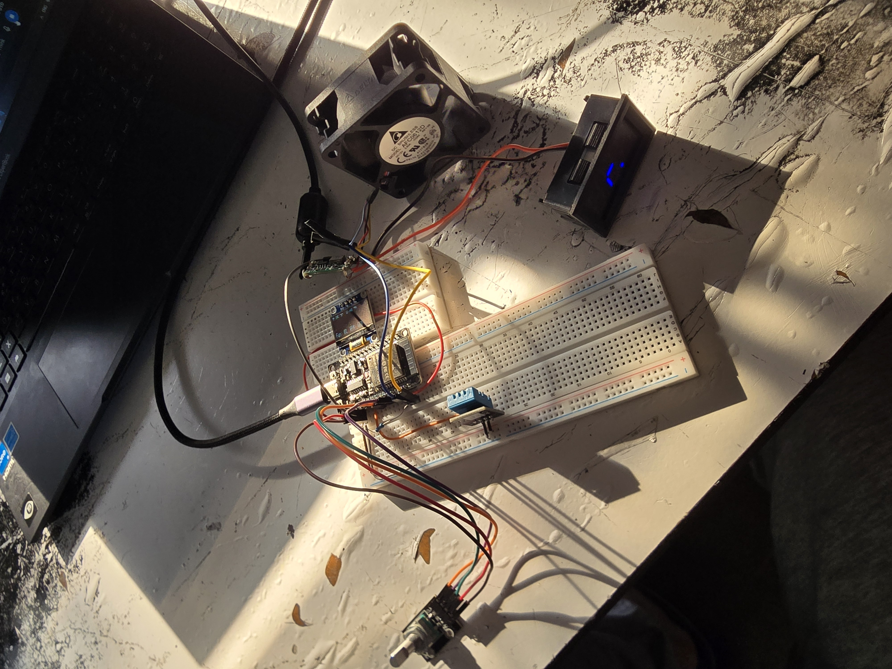

# Smart Ventilation Controller

A standalone ESP32-based ventilation controller that automatically regulates fan speed according to ambient humidity.

This project is a new embedded implementation of an earlier version that used **Home Assistant** as part of the control system. The current version moves the control logic directly onto the ESP32, eliminating network dependency from the control loop.




## Demo

[▶️ Watch the demonstration video](https://youtube.com/shorts/H7Ea2eaupXc?feature=share)

## Overview

The system monitors temperature and humidity using a DHT11 sensor and controls a PWM fan based on the measured humidity.

It provides two operating modes:

* **AUTO** — fan speed is automatically controlled according to humidity.
* **MANUAL** — fan speed can be adjusted using a rotary encoder.

A 128×32 OLED display provides local feedback for:

* Temperature
* Humidity
* Operating mode
* Fan speed
* Fan RPM

The fan tachometer signal is also monitored using an interrupt-based input to measure the actual fan speed.

## From Home Assistant to Edge Computing

The original version of the project relied on Home Assistant for part of the control process.

This introduced a dependency on the network connection between the ESP32 and the external controller. When the connection was unstable or experienced higher latency, control commands could be delayed, resulting in abrupt changes in fan speed rather than smooth and predictable behaviour.

The new implementation moves the complete control loop onto the ESP32.

The ESP32 now performs the entire process locally:

**Sensor → Processing → Control Decision → PWM Output**

This means that:

* No network connection is required for operation.
* No external controller is required.
* Control decisions are made locally.
* Fan response is faster and more predictable.
* Fan-speed changes are smoother and more consistent.

Home Assistant is therefore no longer required for the core operation of the ventilation controller.

## Automatic Control

In AUTO mode, the fan speed is selected according to the measured humidity.

| Humidity | Fan Speed |
| -------- | --------: |
| < 55%    |        0% |
| 55–59%   |       25% |
| 60–74%   |       60% |
| ≥ 75%    |      100% |

The control logic runs locally on the ESP32.

## Manual Control

In MANUAL mode, the rotary encoder controls the fan speed.

Each encoder step changes the fan speed by **5%**.

Pressing the encoder button switches between:

`AUTO → MANUAL → AUTO`

## Hardware

* ESP32
* DHT11 temperature/humidity sensor
* 128×32 SSD1306 OLED display
* Rotary encoder with push button
* PWM-controlled fan
* Fan tachometer output

## Pinout

| Function       | ESP32 GPIO |
| -------------- | ---------: |
| DHT11 Data     |     GPIO 4 |
| OLED SDA       |    GPIO 21 |
| OLED SCL       |    GPIO 27 |
| Encoder CLK    |    GPIO 18 |
| Encoder DT     |    GPIO 19 |
| Encoder SW     |    GPIO 17 |
| Fan PWM        |    GPIO 22 |
| Fan Tachometer |    GPIO 23 |

## Development Environment

The firmware is developed using:

* **C++**
* **Visual Studio Code**
* **PlatformIO**
* **Arduino framework for ESP32**

### Main Libraries

* `DHT`
* `Adafruit GFX`
* `Adafruit SSD1306`
* `RotaryEncoder`

## Firmware Architecture

The firmware follows a non-blocking control approach based on `millis()`.

Different tasks are executed independently according to their required update interval:

* Sensor measurement
* Automatic control
* Manual input
* Button debouncing
* RPM measurement
* OLED updates

The fan tachometer is handled using an interrupt so that incoming pulses can be measured without blocking the main control loop.

This allows sensing, processing, user input and actuation to operate concurrently within the embedded system.

## Project Structure

```text
smart-ventilation-controller/
├── include/
├── lib/
├── src/
│   └── main.cpp
├── test/
├── images/
│   ├── smart-ventilation-controller.jpg
│   ├── auto-mode.jpg
│   ├── manual-mode.jpg
│   └── development.jpg
├── platformio.ini
└── README.md
```

## Project Goal

The goal of this project is to demonstrate a simple **edge-based embedded control system**, where sensing, decision-making and actuation are performed locally on the microcontroller.

The system can therefore operate as a completely standalone ventilation controller without requiring a network connection, Home Assistant or an external automation platform.
